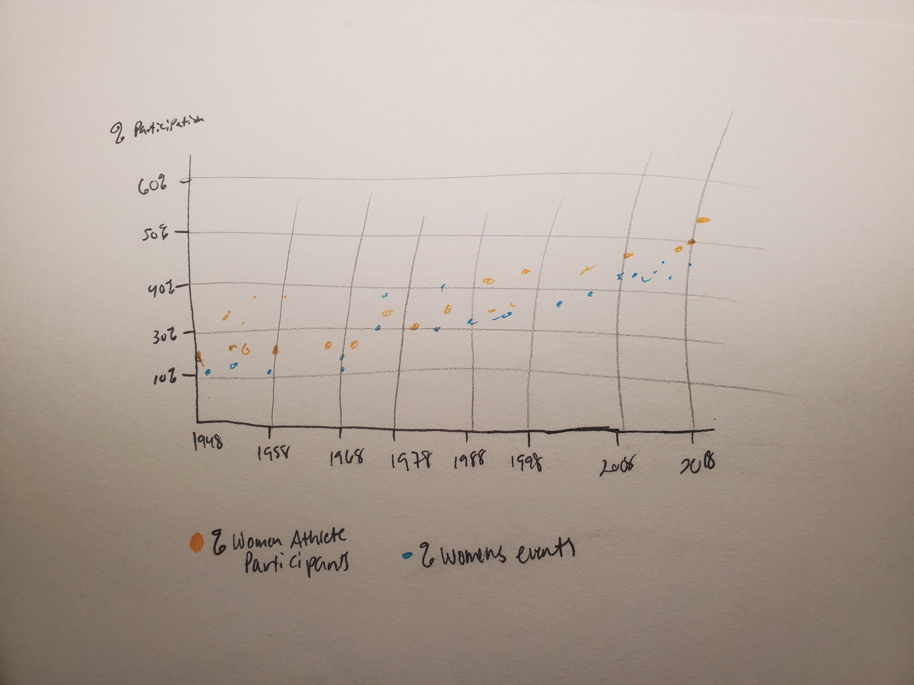
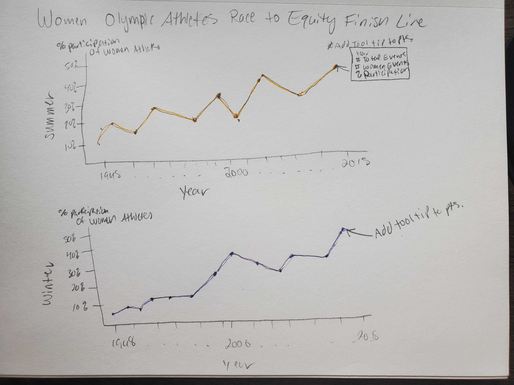

| [Home](https://kcufford.github.io/portfolio/) | [Visualizing Debt](visualizing-government-debt) | [Critique by Design](critique-by-design) | [Final Project I](final-project-part-one) | [Final Project II](final-project-part-two) | [Final Project III](final-project-part-three) |

# Critique by Design

### Part 1: Choosing a Visualization

When choosing a data visualization for this assignment, I wanted to find a topic that was of interest to me. The graphic I picked was originally posted on (www.swimswam.com). This online news organization is the most-read swimming website in the world, and the article features a visualization of the percentage of women participants in the Olympics using data from the International Olympic Committee (IOC).  I grew up around sports and am an avid Olympics fan, so this article caught my eye.  Interestingly, the article not only provides a graph visualization but also includes a data table to show the specific percentage rates for each year. When reading the article and first looking at the visualization, I thought this would be a good context-driven visualization and one that can be easily accessible to a wide audience.

  

-------------

### Part 2: Choosing a Visualization

|    -   | Usefulness | Completeness | Perceptibility | Truthfulness | Intuitiveness | Aesthetics | Engagement | 
| ------| ------| ------| ------| ------| ------| ------| ------|
| Rating |     4      |     3        |       7        |       8      |       6       |      3     |      6     |

_Overall Observations_

The first things that stood out to me were the incomplete title and the gaps on the line. I was particularly curious about the year gaps because the visualization does not indicate what those mean. Was there 0% participation? Was data not available for that year? The lack of completeness and specificity did not work well in the graph. 

The title "%of participants who are women vs." does not properly describe what we are looking at. What are we "versing" women against? Are we missing a second data set to use as a comparison? Additionally, the article focuses more on IOC gender equity (as noted in the title) rather than athlete participation until you get towards the end. At first, I was unsure which group this graph belonged to, but looking at the chart title "Historical Participation of Women at the Summer Olympics" made me realize it was about athletes. A better title could be "Percentage of Women Summer Olympic Athletes Continues to Rise."

Another thing I would change is removing the table of the specific year data points. It isn't necessary to have both, but since it was not an interactive graph, the chart helps viewers who may be more interested in a data point for a specific year. A solution for this is an interactive tool tip along the graph, or a  filter by decade that zooms in to clearly see the lines for the specific percentage data points for the selected year

What worked well with the graph was the layout and simplicity. Using a line chart made the visualization very straightforward, and it was easy to follow the trend of participant changes over time. At a quick glance, it doesn't take much effort to see that something is improving as the years go along. The scaling of both axes makes sense, especially since the x-axis spans over 100 years. There is no chart junk on either the graph or the table, so that eliminates any distractions. The font was readable, and hierarchy was demonstrated with the larger font size of the title.

_Primary Audience_

This visualization's primary audience is people interested in Olympic athletes, with a particular focus on the interest of equity for women in sports. The website the visualization is on is geared towards swimming athletes, so the specific topic of female participation in the Olympics could be of interest to website visitors. The most decorated female swimmer of all time is Katie Ledecky, so there could be a large audience from the website to the athletic community and non-athletes interested in the Olympics. The article was posted in 2020, which was supposed to be an Olympic year. This story would be timely for when it was written, and the visualization could spark conversation across different demographics if done well.

However, I don't think this visualization is effective at reaching the audience. For example, if only the line chat were shared online as-is, there would be no indication that this is about female Olympic athletes, their growth in participation, and the continuing conversation around equity in the Olympics. This is due to elements mentioned in the previous question, such as having a poor title and needing more clarification on the line gaps. It feels incomplete and leaves audiences confused.

_Critique Method Thoughts & Recommendations_

This method of critiquing made me dig into the details more than the Good Charts method. Good Charts is a good introduction to a high-level view of critiquing. It touches on the "why" behind likes/dislikes, but I found that the Few method goes deeper into the "why". This method is more all-encompassing, specifically focusing on clarity and audience. Audience understanding is at the heart of creating the visualization. Focusing on perception and intuitiveness allows a deeper look into the visualization's meaning rather than focusing solely on design elements/aesthetics.
 
Since the data focuses on women athlete participation rather than IOC committee makeup, these are the elements I would recommend changes for:

1. The original title is incomplete, so updating it to something like "Women Olympic Athletes Continue to Run Towards the Equity Finish Line" would tell a better story.
 
2. Changing the data points/focus. The data download has so many more data points to play with! The chart on the website only shows Summer Olympic data, but the download also includes winter participation. For a story about overall participation, including the data points on both summer and winter participation is important to get the whole picture.

 3. Digging into the data more, I would change the layout to a scatter plot to show the comparison of % of women Participants to % of women events by year. This could be an interesting way to showcase the trend of the increasing % of participation by also comparing the % of women's events offered in the Olympics to see if there is any correlation. Since I don't have any information on the "Gap years, I would start the visualization in the year 1948, so it is a continuous flow of data.

-------------

### Part 3: Wireframe

For my initial redesign, I wanted to use more of the dataset than what was utilized in the original article.

The first wireframe I did was testing out the scatter plot recommendation I gave in part 3. I first sketched the idea, and then tried to recreate it in Tableau. I found that in this case, comparing the % of women participants to the % of women's events on each axis would better show the correlation. However, this proved unsuccessful at visually seeing the increasing trend over time.

<noscript></noscript><object class='tableauViz'  style='display:none;'><param name='host_url' value='https%3A%2F%2Fpublic.tableau.com%2F' /> <param name='embed_code_version' value='3' /> <param name='site_root' value='' /><param name='name' value='IOC2_17071930379580&#47;Sheet1' /><param name='tabs' value='no' /><param name='toolbar' value='yes' /><param name='static_image' value='https:&#47;&#47;public.tableau.com&#47;static&#47;images&#47;IO&#47;IOC2_17071930379580&#47;Sheet1&#47;1.png' /> <param name='animate_transition' value='yes' /><param name='display_static_image' value='yes' /><param name='display_spinner' value='yes' /><param name='display_overlay' value='yes' /><param name='display_count' value='yes' /><param name='language' value='en-US' /></object>

 

My next idea was to recreate the line chart but include more detail than the original. In this case, I followed my recommendation of starting at 1948 and separating the Winter and Summer Olympic data.  I liked this better than the original because it makes for an easy comparison between the two, however I did notice that the trend lines were similar, which was also noted in my feedback in Part 4.

 

Before sending for critique, I wanted to try one more idea in Tableau, and that was to do a double bar chart with the X axis as the year with summer/winter shown for each year as an individual bar, and then % of women participants on the Y axis. I couldn't figure out how to do the side-by-side double bar graph, so Tableau defaulted to a stacked bar graph. I quickly realized this visualization would not work because starting in 1992, the Winter and Summer Olympics rotated years, whereas prior to this time, both were held in the same year.  This resulted in a hard-to-read graph that would be confusing for the viewer to interpret. Additionally, this type of graph sums the percentage of the year, so, at its peak, it shows over 55% participation when the highest for a single season has now reached 47.7%. This could potentially be seen as a misrepresentation in the context of the article. 

<noscript></noscript><object class='tableauViz'  style='display:none;'><param name='host_url' value='https%3A%2F%2Fpublic.tableau.com%2F' /> <param name='embed_code_version' value='3' /> <param name='site_root' value='' /><param name='name' value='IOC2a&#47;Sheet4' /><param name='tabs' value='no' /><param name='toolbar' value='yes' /><param name='static_image' value='https:&#47;&#47;public.tableau.com&#47;static&#47;images&#47;IO&#47;IOC2a&#47;Sheet4&#47;1.png' /> <param name='animate_transition' value='yes' /><param name='display_static_image' value='yes' /><param name='display_spinner' value='yes' /><param name='display_overlay' value='yes' /><param name='display_count' value='yes' /><param name='language' value='en-US' /><param name='filter' value='publish=yes' /></object>

 

After this test, I decided to move forward with my second option of the double-line graph for feedback in Part 4. Given that I concluded that the audience for this data is general, this style of visualization would be recognizable for viewers to grasp the story and interpret the data.

-------------

### Part 4: Test the Solution

|    -   | Feedback |
| ------| ------| 
| Male student, late 20’s |  I am not really sure what equity means in this context. The sketch is the number of events and participation changes every other year, and there is a pretty decent drop and backup. The intended audience is anyone interested in the Olympics. I think it should be clearer what you are trying to show via title.     | 
| Female student, early 20’s |  The sketch is of two graphs showing how participation by women athletes has changed over time in both the summer and winter Olympics. They show how Olympians who are women are reaching parity with their male counterparts. Nothing is surprising/confusing.  This is for a general audience, and I could see this information being of particular interest to those who follow the Olympics/other sports, but also those who keep up with pop culture/the news in general. The information is very accessible. Perhaps make it a double-line graph. Since both graphs show the same general trend, I think it would work for them to overlap on the same plot. I really like the topic, and the title of the graph is very creative!     | 
| Male student, late 20’s |  This is a sketch of graphs showing the number of women athletes in the summer and winter Olympics from 1948 to 2018 and shows the overall increase in the number of women athletes. It's very surprising that there's a noticeable dip for the 2000 Olympics for both summer and winter. The Summer Olympics dip seemed to have a huge increase, but interestingly, the Winter Olympics saw only a steady increase. The audience is people interested in gender equality/feminism in sports. I think showing how many were team sports vs. individual sports could add some context; also, knowing the total number of athletes in the year would help create a good metric for understanding the increase.  | 
| Male freelance worker, early 30’s |  This shows the percentage of women in the Olympics over time and thatit raises over time. The axis labels were a bit confusing, it would be helpful to move the % to the Y axis and swap it for the summer/winter label.  The intended audience is women and athletes.  | 
| Male student, early 30’s |  This chart covers women’s equity in Olympic participation. It tells me that the percentage of women athletes participating in both the Winter and Summer Olympics has increased since 1948 and now sits around 50%. It is interesting, though that it is not at 50% as sometimes the Olympics still seem male-centric. The audience is anyone interested in women’s sports or the Olympics. 1948 is hard to read on the axis. Overall, it looks great! | 
